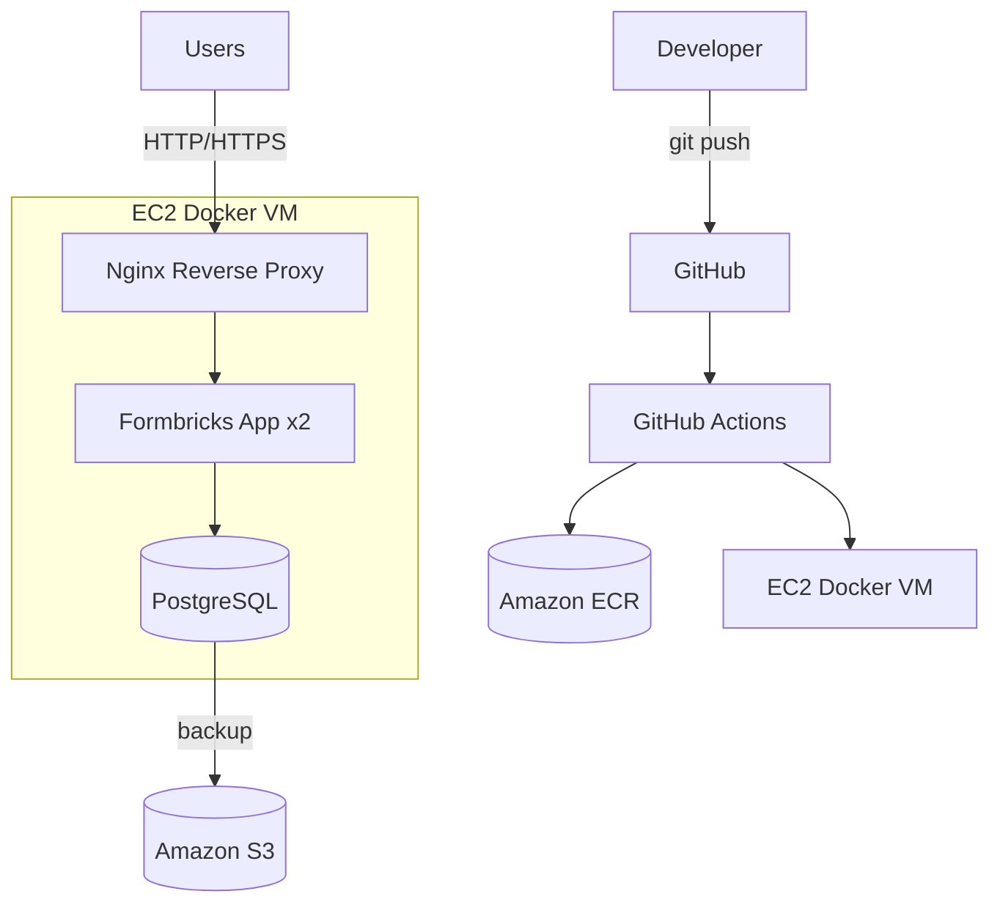

# Architecture

```mermaid
graph TD
  dev[Developer] -->|git push| gh[GitHub]
  gh --> gha[GitHub Actions]
  gha --> ecr[(Amazon ECR)]
  gha --> ec2[EC2 Docker VM]

  subgraph ec2box[EC2 Docker VM]
    nginx[Nginx Reverse Proxy]
    app1[Formbricks App x2]
    db[(PostgreSQL)]
  end

  nginx --> app1
  app1 --> db
  db -->|backup| s3[(Amazon S3)]

  users[Users] -->|HTTP/HTTPS| nginx
```
